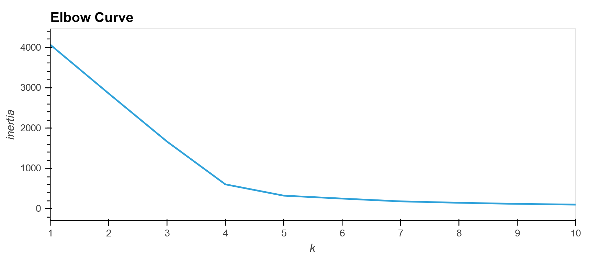
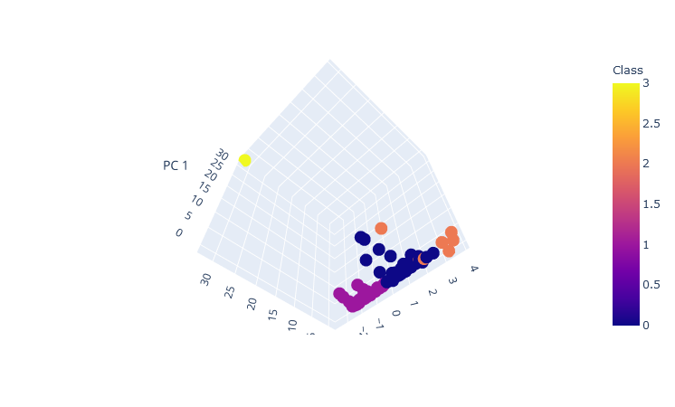
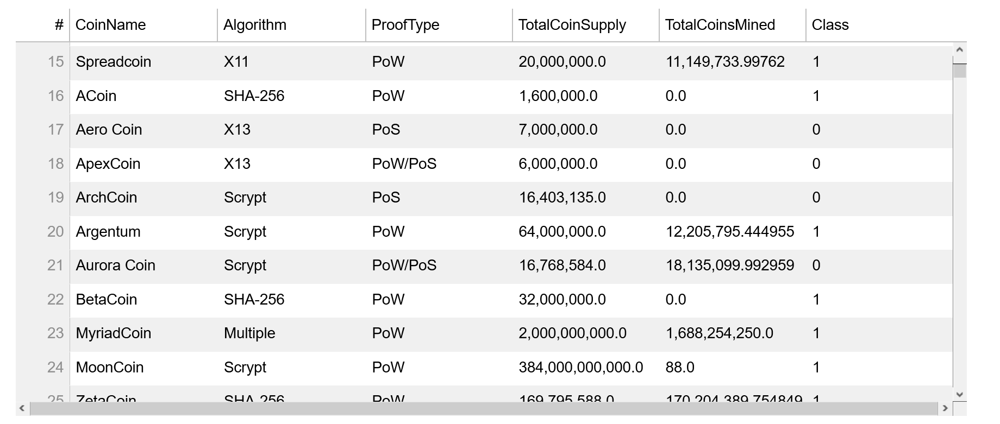
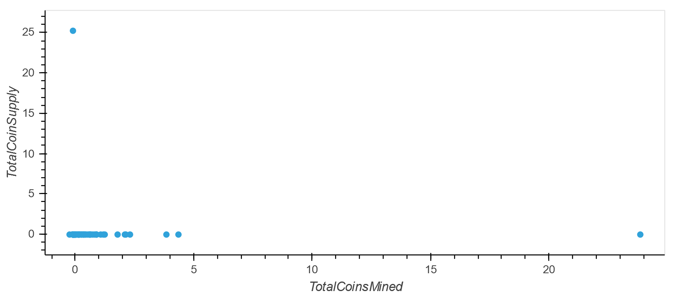
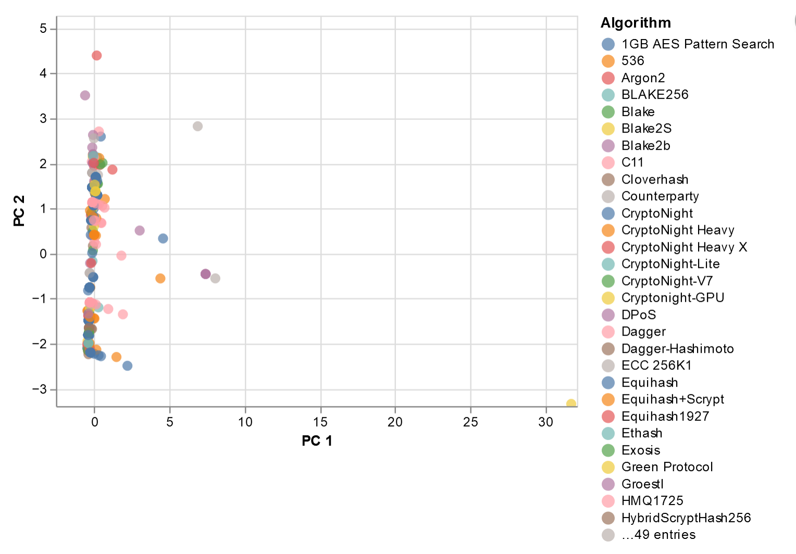
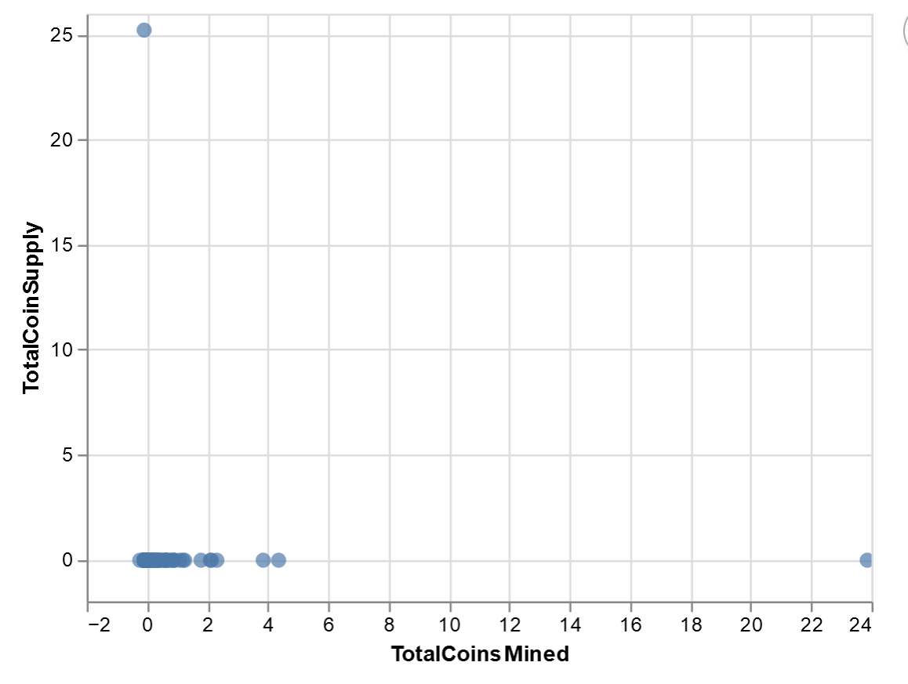

# ClusteringCrypto

## Overview
There are two files here that do clustering for the crypto market: 

1.[HV Plot](#1---HV-Plot) 
2.[Altair](#2---Altair)

### 1 - HV Plot
[crypto_clustering](./crypto_clustering.ipynb) 
The HV Plot does the Clustering for Crypto Analysis.It uses HV Plot to show the output.
#### Elbow Plot

#### 3D Plot

#### Table

#### Scatter Plot

### 2 - Altair
[crypto_clustering_sm](./crypto_clustering_sm.ipynb) 
The Altiar file performs the same items for Amazon Sagemaker using Altair to show the ouput.
#### Altair Elbow Plot

#### 3D Plot

#### Scatter Plot

